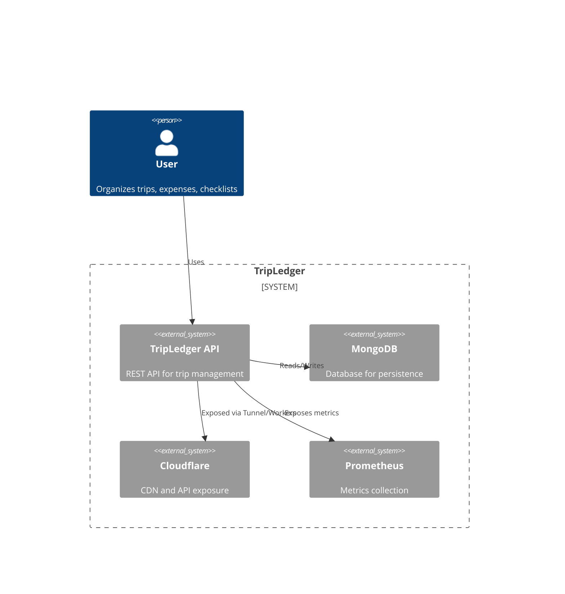
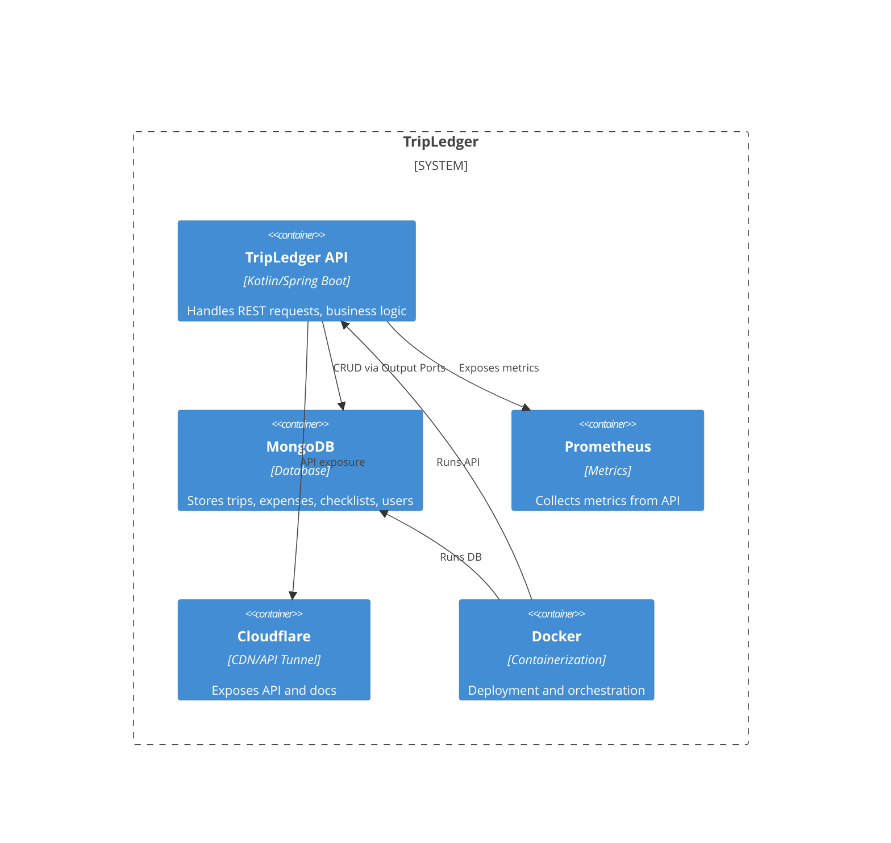
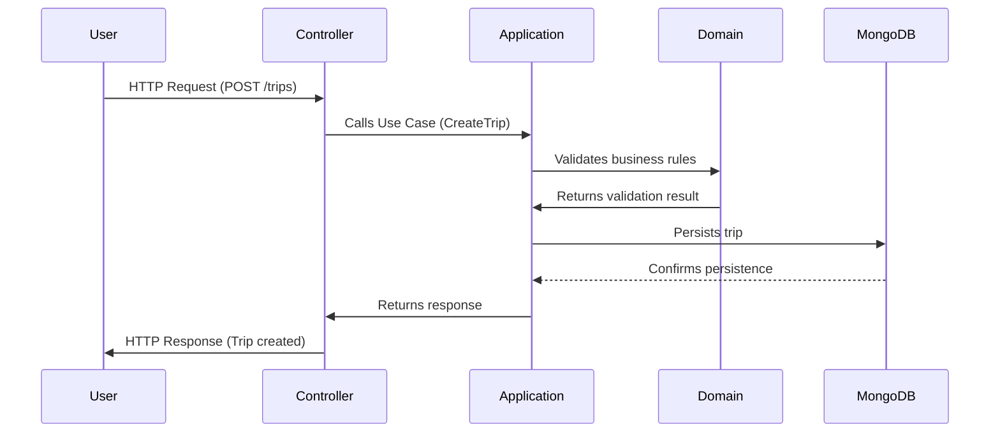

# ADR-001 — Architectural Foundation

> [Portuguese version](../pt/ADR-001.md)

## Status
Accepted

## Date
2026-02-22

## Context

TripLedger is a backend system designed to manage trips, expenses, checklists, and users. The project aims to demonstrate strong backend engineering skills, apply Domain-Driven Design (DDD), enforce Hexagonal Architecture, and ensure modular isolation. It is intended as a professional portfolio artifact and is built with Kotlin, Spring Boot, and MongoDB.

The architecture must:
- Maintain strict separation of concerns
- Support modularity and future microservice extraction
- Enable clean boundaries for domain, application, and adapter layers
- Serve as a reference for AI-assisted code generation
- Be production-ready and cloud-aware

---

## Decision

TripLedger will be implemented as a **Modular Monolith** using **Hexagonal Architecture (Ports & Adapters)**. The system will be divided into independent modules:
- Trip (Core)
- Expense
- Checklist
- User
- Shared (cross-cutting concerns)

Each module will follow strict boundaries:
- **Domain Layer**: Entities, value objects, domain services, business rules. No framework dependencies.
- **Application Layer**: Use cases, input/output ports, orchestration logic. Coordinates domain operations.
- **Adapter Layer**: REST controllers (input), Mongo repositories (output), external integrations. Implements ports defined in the application layer. No business rules here.

Inter-module communication must occur only through defined ports (interfaces). No module accesses another module’s adapters or domain directly.

Persistence is handled by a single MongoDB database with separate collections per module. All IDs are UUIDs for global uniqueness. Indexes are applied per collection for common queries.

Observability is ensured via Spring Boot Actuator, structured logging, Prometheus metrics, and health checks. Deployment uses Docker, docker-compose for local Mongo, and Cloudflare for API exposure and static documentation.

---

## Rationale

- Modular Monolith provides simplicity, maintainability, and a clean evolutionary path
- Hexagonal Architecture enforces separation of concerns and domain purity
- REST APIs are chosen for simplicity and integration readiness
- Single MongoDB database reduces operational complexity while maintaining logical modularity
- Observability and DevOps practices ensure production readiness and cloud competence
- AI-assisted code generation follows architectural discipline

Microservices, GraphQL, and gRPC were considered but rejected due to unnecessary complexity at this stage.

---

## Consequences

- High cohesion within modules
- Low coupling between modules
- Maintainable, testable, and extendable code
- Ready for future microservice extraction
- Clear demonstration of backend, architectural, and DevOps skills
- Production-ready, cloud-aware portfolio artifact

---

## C4 Diagrams

### Context Diagram



### Container Diagram



### Component Diagram

```mermaid
C4Component
Container_Boundary(api, "TripLedger API") {
  Component(domain, "Domain Layer", "Entities, Value Objects, Domain Services, Business Rules")
  Component(application, "Application Layer", "Use Cases, Ports, Orchestration")
  Component(adapter, "Adapter Layer", "REST Controllers, Mongo Repositories, Integrations")
  Component(shared, "Shared Module", "Cross-cutting concerns")
}
Rel(domain, application, "Used by")
Rel(application, adapter, "Ports implemented by Adapters")
Rel(adapter, mongo, "Persistence")
Rel(adapter, cloudflare, "API exposure")
```

---

## Sequence Diagram

### Typical REST Request Flow


