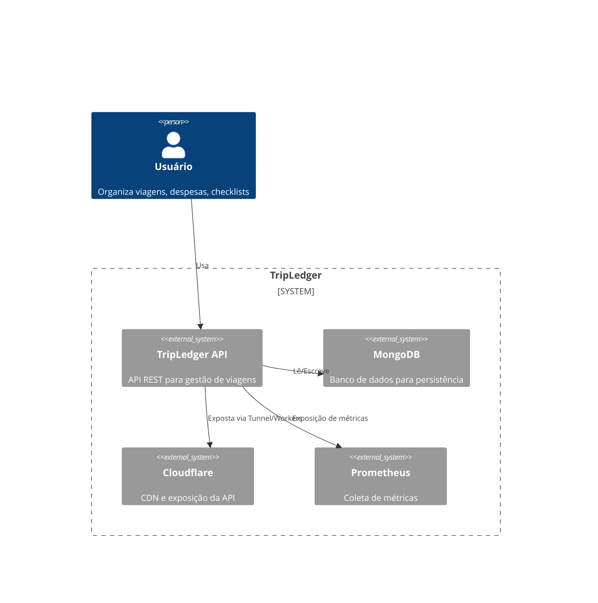
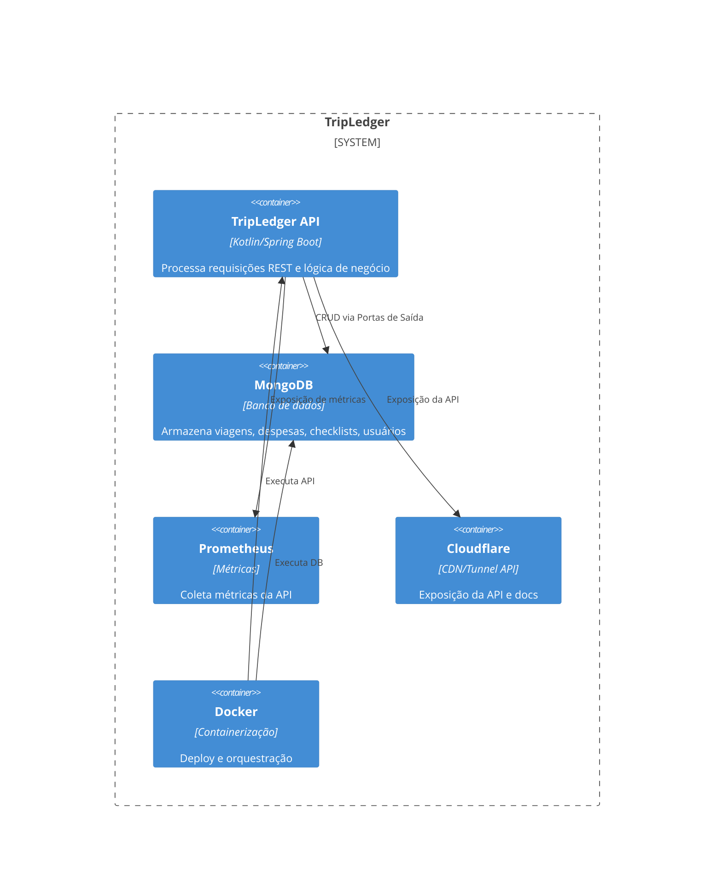
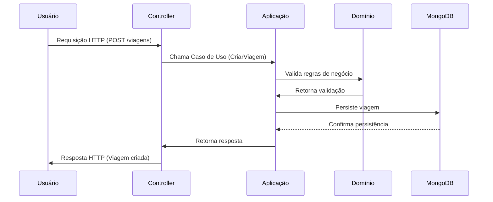

# ADR-001 — Fundamentos Arquiteturais

> [Versão em inglês](../en/ADR-001.md)

## Status
Accepted

## Data
2026-02-22

## Contexto

TripLedger é um sistema backend projetado para gerenciar viagens, despesas, checklists e usuários. O projeto tem como objetivo demonstrar habilidades avançadas de engenharia backend, aplicar Domain-Driven Design (DDD), reforçar a Arquitetura Hexagonal e garantir isolamento modular. É um artefato profissional de portfólio, desenvolvido com Kotlin, Spring Boot e MongoDB.

A arquitetura deve:
- Manter separação rigorosa de responsabilidades
- Suportar modularidade e futura extração de microserviços
- Garantir limites claros para as camadas de domínio, aplicação e adaptadores
- Servir como referência para geração de código assistida por IA
- Ser pronta para produção e consciente de nuvem

---

## Decisão

TripLedger será implementado como um **Monolito Modular** usando **Arquitetura Hexagonal (Ports & Adapters)**. O sistema será dividido em módulos independentes:
- Viagem (Core)
- Despesa
- Checklist
- Usuário
- Shared (cross-cutting concerns)

Cada módulo seguirá limites rigorosos:
- **Camada de Domínio**: Entidades, objetos de valor, serviços de domínio, regras de negócio. Sem dependências de frameworks.
- **Camada de Aplicação**: Casos de uso, portas de entrada/saída, lógica de orquestração. Coordena operações do domínio.
- **Camada de Adaptadores**: Controllers REST (entrada), repositórios Mongo (saída), integrações externas. Implementa portas definidas na camada de aplicação. Não contém regras de negócio.

A comunicação entre módulos deve ocorrer apenas por portas (interfaces) definidas. Nenhum módulo acessa adaptadores ou domínio de outro módulo diretamente.

A persistência é feita em um único banco MongoDB, com coleções separadas por módulo. Todos os IDs são UUIDs para unicidade global. Índices são aplicados por coleção para consultas comuns.

Observabilidade é garantida via Spring Boot Actuator, logging estruturado, métricas Prometheus e health checks. O deploy utiliza Docker, docker-compose para Mongo local e Cloudflare para exposição da API e documentação estática.

---

## Justificativa

- Monolito Modular oferece simplicidade, manutenibilidade e caminho evolutivo limpo
- Arquitetura Hexagonal reforça separação de responsabilidades e pureza do domínio
- APIs REST são escolhidas pela simplicidade e facilidade de integração
- Banco MongoDB único reduz complexidade operacional mantendo modularidade lógica
- Observabilidade e práticas DevOps garantem prontidão para produção e competência cloud
- Geração de código assistida por IA segue disciplina arquitetural

Microserviços, GraphQL e gRPC foram considerados, mas rejeitados devido à complexidade desnecessária neste estágio.

---

## Consequências

- Alta coesão dentro dos módulos
- Baixo acoplamento entre módulos
- Código manutenível, testável e extensível
- Pronto para futura extração de microserviços
- Demonstração clara de habilidades backend, arquiteturais e DevOps
- Artefato de portfólio pronto para produção e nuvem

---

## Diagramas C4

### Diagrama de Contexto



### Diagrama de Containers



### Diagrama de Componentes

```mermaid
C4Component
Container_Boundary(api, "TripLedger API") {
  Component(domain, "Camada de Domínio", "Entidades, Objetos de Valor, Serviços de Domínio, Regras de Negócio")
  Component(application, "Camada de Aplicação", "Casos de Uso, Portas, Orquestração")
  Component(adapter, "Camada de Adaptadores", "Controllers REST, Repositórios Mongo, Integrações")
  Component(shared, "Módulo Shared", "Cross-cutting concerns")
}
Rel(domain, application, "Usado por")
Rel(application, adapter, "Portas implementadas por Adaptadores")
Rel(adapter, mongo, "Persistência")
Rel(adapter, cloudflare, "Exposição da API")
```

---

## Diagrama de Sequência

### Fluxo típico de requisição REST


